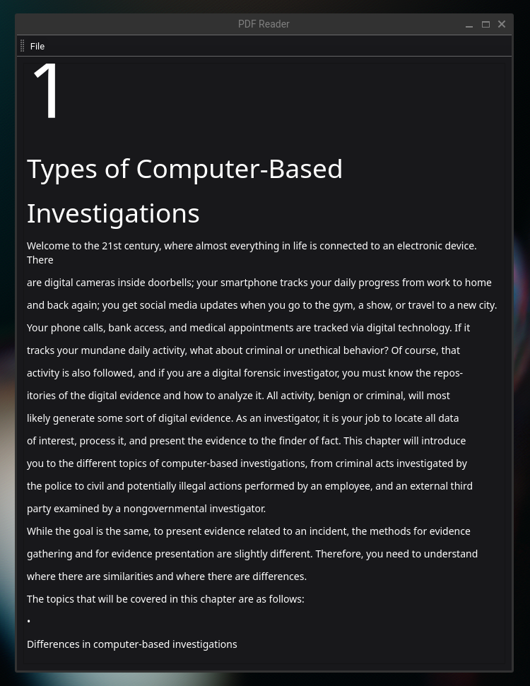

# PDF Reader Application

Welcome to my PDF Reader, a simple and handy tool written in Python. The tool allows you to open and read .pdf files, displaying them as rich text along with images and tables in a user-friendly interface.



## Features

- Open and read .pdf files
- Render PDF files as rich text along with images and tables
- Dynamically resize the reading pane
- Clear and simple User Interface

## Limitations

- This application currently supports only PDF files. Other file types are not supported.
- The PDF Reader does not support advanced PDF features like annotations, forms, or interactive elements.

## Usage

1. Start the application.
2. Click on the 'File' button in the toolbar at the top of the application.
3. A file dialog will open, navigate and select the .pdf file that you want to read.
4. The content of the selected PDF file will be shown in the application as rich text, images, and tables.

## Dependencies

The application is built using Python 3.12.1, and it also uses the following packages:
- PyQt6
- PyMuPDF

You would need to have these installed to run the app.

## Building

Install pyinstaller

```bash
pip install pyinstaller
```

```bash
pyinstaller main.spec
```

Thank you for using the PDF Reader application!